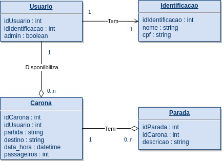

# SISPRO SQL CHALLENGE

This challenge aims to create tables based on an ER model below and develop SQL queries to answer specific questions.

## Requirements

- Create SQL statements to create tables and their relationships.
- Create SQL queries to answer the following questions:

  1. What are the rides to Praia Vermelha from July 1st, 2022?
  2. What are the names of the users who offer rides from São Gonçalo?
  3. What are the names of the users who offer rides with at least 2 passengers and a stop at Plaza Shopping?

## Organization

The project has two folders: `queries` and `tables`. The `queries` folder contains three SQL files with the queries, and the `tables` folder contains four files with the DDL to create the tables.

## Usage

1. Clone the repository: `git clone https://github.com/mathunes/sispro-challenge-sql.git`
2. Navigate to the project directory: `cd sispro-challenge-sql`
3. Create the tables by running the SQL statements in the `tables` folder.
4. Load the data into the tables, if necessary.
5. Run the SQL queries in the `queries` folder to answer the questions.

## Contributing

If you want to contribute to this project, please follow the guidelines below:

1. Fork the repository.
2. Create a new branch: `git checkout -b <my-new-branch>`
3. Make changes and test them.
4. Add the changes: `git add .`
5. Commit your changes: `git commit -m "Add some feature"`
6. Push to the branch: `git push origin <my-new-branch>`
7. Submit a pull request to the original repository.

## License

This project is licensed under the [MIT License](https://opensource.org/licenses/MIT).
